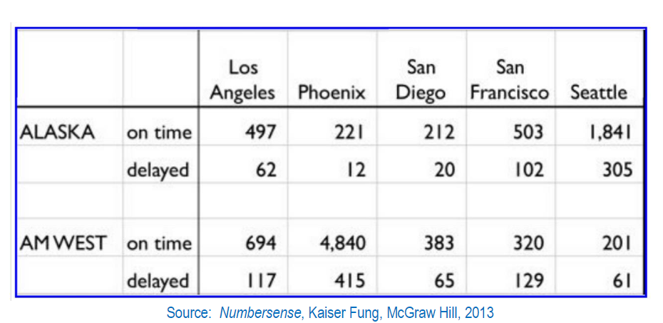

## Overview

First we create a csv file to represent this chart:

```{r pressure, echo=FALSE, fig.cap="", out.width = '100%'}

```

And then load it into R. The goal is to then transform the data from wide to long, and then 
perform some analysis on the data.

```{r}
airline_data <- read.csv('airlinedata.csv')
airline_data
```

```{r}
pacman::p_load(dplyr, tidyr, magrittr)

#Transform from a wide format to long by grouping the locations into a 'Destination' column
long_data <- gather(airline_data, 'Destination', 'Num_Flights', 3:7)
long_data
```

```{r}
Alaska_Delayed <- long_data %>%
  select(Num_Flights) %>%
  filter(long_data$Airline == 'Alaska', long_data$On_time_delayed == 'delayed')

Alaska_ontime <- long_data %>%
  select(Num_Flights) %>%
  filter(long_data$Airline == 'Alaska', long_data$On_time_delayed == 'on time')

AMWest_Delayed <- long_data %>%
  select(Num_Flights) %>%
  filter(long_data$Airline == 'AMWest', long_data$On_time_delayed == 'delayed')

AMWest_ontime <- long_data %>%
  select(Num_Flights) %>%
  filter(long_data$Airline == 'AMWest', long_data$On_time_delayed == 'on time')

Destination <- distinct(long_data, Destination)
```

```{r}
#Re-organize the data so that we can see the number of flights delayed or on time for each airline.  Each row represents a different destination.  Also added columns of total on time flights, delayed flights, and total flights for each destination.


totals <- data.frame(c(Destination, Alaska_Delayed, Alaska_ontime, AMWest_Delayed, AMWest_ontime))
colnames(totals) <- c('Destination', 'Alaska_Delayed', 'Alaska_ontime', 'AMWest_Delayed', 'AMWest_ontime')

totals %<>% 
  mutate(On_time = Alaska_ontime + AMWest_ontime) %>%
  mutate(Delayed = Alaska_Delayed + AMWest_Delayed) %>%
  mutate(Flights = Alaska_Delayed + Alaska_ontime + AMWest_Delayed + AMWest_ontime)

totals
```

```{r}
Alaska_Delayed <- sum(totals$Alaska_Delayed)
Alaska_ontime <- sum(totals$Alaska_ontime)
Alaska_flights <- Alaska_Delayed + Alaska_ontime
AMWest_Delayed <- sum(totals$AMWest_Delayed)
AMWest_ontime <- sum(totals$AMWest_ontime)
AMWest_flights <- AMWest_Delayed + AMWest_ontime
```

```{r}
#Delayed Percentages by Airline
Alaska_p <- (Alaska_Delayed / Alaska_flights) * 100
AMWest_p <- (AMWest_Delayed / AMWest_flights) * 100

cat('The percentage of flights delayed for Alaska Airlines is:', Alaska_p, '%\n')
cat('The percentage of flights delayed for AMWest Airlines is:', AMWest_p, '%')
```

```{r}
#Delayed Percentages by Destination
LA_p <- (totals[1, 7] / totals[1,8]) * 100
PHO_p <- (totals[2, 7] / totals[2,8]) * 100
SD_p <- (totals[3, 7] / totals[3,8]) * 100
SF_p <- (totals[4, 7] / totals[4,8]) * 100
SEA_p <- (totals[5, 7] / totals[5,8]) * 100

cat('The percentage of flights delayed heading to Los Angeles is:', LA_p, '%\n')
cat('The percentage of flights delayed heading to Phoenix is:', PHO_p, '%\n')
cat('The percentage of flights delayed heading to San Diego is:', SD_p, '%\n')
cat('The percentage of flights delayed heading to San Francisco is:', SF_p, '%\n')
cat('The percentage of flights delayed heading to Seattle is:', SEA_p, '%')
```

## Conclusion 

From the analysis we found:


The Airline that was more frequently on time was AMWest Airlines.

The Destination that flights were most frequently delayed for was San Francisco.

The Destination that flights were least frequently delayed for was Phoenix.
