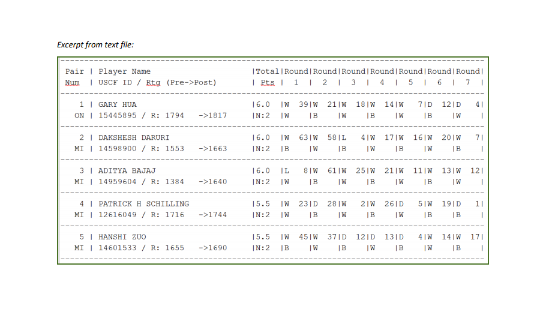

# Overview 

We are given a text file, tournamentinfo.txt, which has a table of data from a chess tournament.  The data includes the 64 contestants' name, state they are from, total points scored, their pre-rating, and the results of the matches of who they played against.  I read the file into R using readLines, then extracted the names, states, points, and pre-ratings using regular expressions and stringr.  To calculate the opponent pre-rating average, I extracted a list of each player's opponents by number.  I then looped through the list, taking the mean of the opponents' pre-rating for each individual player.  I then saved the data frame in csv format as tournamentinfo.csv.

```{r setup, include=FALSE}
knitr::opts_chunk$set(echo = TRUE)
```

## R Markdown

```{r pressure, echo=FALSE, fig.cap="", out.width = '100%'}

```

```{r}
text = readLines('tournamentinfo.txt')

#Remove the Header
text = text[5: 195]

#Isolate lines from the text file containing the player names
names_lines = text[seq(1, 192, 3)]

pacman::p_load(stringr)

names = str_extract_all(names_lines, "[A-Z]*[[:space:]]+[A-Z]*[[:space:]]*[A-Z]*[[:space:]]*[A-Z]+")
names = unlist(names)
names
```

```{r}
names = tolower(names)

simpleCap <- function(x) {
  s <- strsplit(x, " ")[[1]]
  paste(toupper(substring(s, 1,1)), substring(s, 2),
      sep="", collapse=" ")
}

names = lapply(names, simpleCap)
names = unlist(names)

names
```

```{r}
chess = data.frame(Name = names)
```

```{r}
states_lines = text[seq(2, 192, 3)]
states = str_extract_all(states_lines, "[A-Z]{2,}")

states = unlist(states)
states
```

```{r}
chess$State = states
```

```{r}
names_lines

points = str_extract_all(names_lines, ".\\..")
points = unlist(points)
points
```

```{r}
chess$Total_Points = points
```

```{r}
pre_rating = str_extract_all(states_lines, "[[:space:]]{1}[0-9]{3,4}[[:space:]]{1}|[[:space:]]{1}[0-9]{3,4}P")
pre_rating = unlist(pre_rating)

pre_rating = trimws(pre_rating)
pre_rating = str_remove_all(pre_rating, "P")

pre_rating
```

```{r}
chess$Pre_Rating = pre_rating
```

```{r}
chess$Opponent_Pre_Rating_Avg = 0

head(chess)
```

```{r}
pacman::p_load(dplyr, tidyr, magrittr)
```

```{r}
chess %<>%
  mutate(State = factor(State)) %>%
  mutate(Total_Points = as.double(Total_Points)) %>%
  mutate(Pre_Rating = as.double(Pre_Rating))

head(chess)
```

```{r}
opponents = str_extract_all(names_lines, "W[[:space:]]+[0-9]+|D[[:space:]]+[0-9]+|L[[:space:]]+[0-9]+")
opponents
```

```{r}
opponents = str_extract_all(opponents, "[[:space:]]{1}[0-9]+")
```

```{r}
opponents = lapply(opponents, trimws)
opponents = lapply(opponents, as.numeric)
```

```{r}
opponents
```

```{r}
for (i in 1:length(opponents)){
  x = 0
  for (c in opponents[i][1]){
    x = x + chess$Pre_Rating[c]
  }
  chess$Opponent_Pre_Rating_Avg[i] = mean(x)
}

chess$Opponent_Pre_Rating_Avg = round(chess$Opponent_Pre_Rating_Avg)
```

```{r}
head(chess)
```

```{r}
write.csv(chess, 'tournamentinfo.csv', row.names = FALSE)
```

